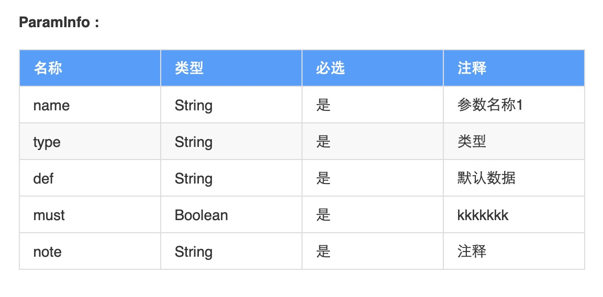

# showdoc-edit
Automatically generate class
# 如何启动
运行 RunScanDemo.main

# 如何使用
## 命令
“stop”  结束命令，任何时候可输入 <br>
"reset" 重置命令，任何时候可输入 <br>
"ok"    确认命令，结束对象输入，执行解析操作

## 使用

### 启动后

```text
================================
请选择标题类型：	 1.入参 2.出参

```

### 选择标题格式
格式可自定义展示标题及顺序

```text
================================
请选择标题类型：	 1.入参 2.出参
1
请输入对象属性：


```
### 输入对象
可识别多种注释方式，将ParamInfo 中数据作为示例输入,以确认命令“ok”结尾

```text
请输入对象属性：

public class ParamInfo {


    private String name; // 参数名称1

    /**
     * 类型
     */
    private String type;

    // 默认数据
    private String def;

    /** kkkkkkk */
    private Boolean must = true;

    /**
     注释 */
    private String note = "  没有 注释！";

ok
```

### 复制结果

将输出数据复制到showdock中

```text
##### ParamInfo :

|名称 |类型 |必选 |注释 |
|: ----|: ----|: ----|: ----|
|name |String |是 |参数名称1 |
|type |String |是 |类型 |
|def |String |是 |默认数据 |
|must |Boolean |是 |kkkkkkk |
|note |String |是 |注释 |

```

### 成品




# 自定义

## 标题格式（列）

打开ExUtil文件

```java

    static {
        // 注册标题（列）名称，key（英文） 在代码中使用，value（中文名称）在生成的表中使用，中文名称可改
        cnNameMap.put("cnName", "名称");
        cnNameMap.put("type", "类型");
        cnNameMap.put("must", "必选");
        cnNameMap.put("def", "默认");
        cnNameMap.put("note", "注释");
        // 1.title排版与命名  request 是入参格式，response是出参格式
        // 2.标题按照在数组中的位置排序
        //   如 ["cnName", "type", "note"],在生成的表中将展示为 "名称 类型 注释"
        // 3.展示数量及顺序可调整，但仅限于上述5个标题
        // 4.如果要新加title模版，记得在RunScanDemo.main中添加相应的选项
        titleMap.put("request", new String[]{"cnName", "type", "must", "note"}); // "名称 类型 必选 注释"
        titleMap.put("response", new String[]{"cnName", "type", "note"}); // "名称 类型 注释"
    }

```


